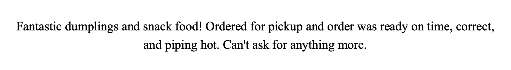
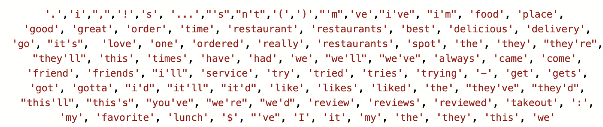
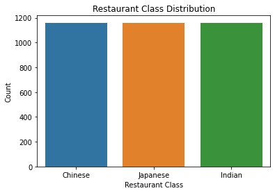
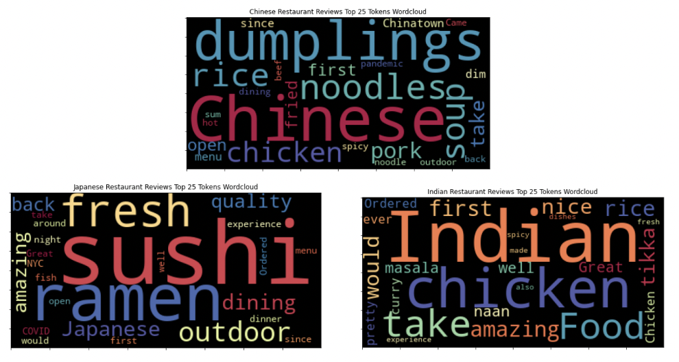
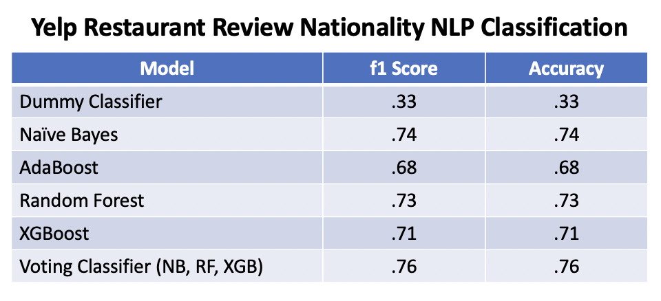
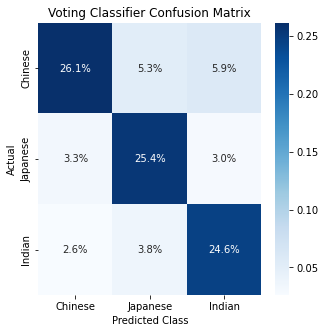
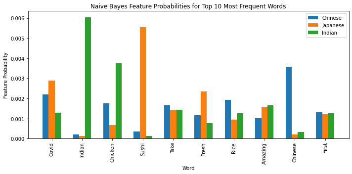
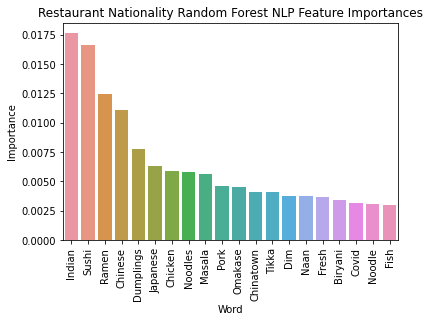

# NLP Classification of Restaurant Yelp Reviews by Nationality

## Introduction

I set out to build a model that could use NLP to segment Yelp reviews into the class of restaurant they covered. In order to limit the computational resources required, I initially selected 3 classes of restaurants to model: Chinese, Japanese and Indian. Once I had successfully modeled these three classes, I could attempt to expand the project to include more classes. This model could in turn have a variety of uses including targeting advertisements based on review class or as a means of confirming that restaurant reviews are for the correct class of restaurant they are associated with.

I obtained 3,560 160 character review snippets from the Yelp Fusion API. The reviews covered 3 classes: Chinese, Japanese and Indian restaurants. I preprocessed the reviews through tokenization and removing stopwords.I built 4 models (Naïve Bayes, Adaboost, Random Forest and XGBoost) as well as a Voting Classifier. All models significantly outperformed the baseline Stratified Dummy Classifier (Test f1 score: .33). The top performing individual model was Naive Bayes (Test f1 score: .74), while the top performing overall model was a Voting Classifier of Naïve Bayes, Random Forest and XGBoost (Test f1 score: .76). Based on their outperformance versus the Dummy Classifier, these models were useful in segmenting Yelp reviews by restaurant class for future use.

## Obtain Data

I obtained Yelp restaurant review snippets by first requesting lists of Chinese, Japanese and Indian restaurants in the New York City area from the Yelp Fusion API. I then requested three reviews for each of these restaurants from the API. Each snippet consisted of the first 160 characters of a review from the Yelp website. I obtained 1,200 reviews for the Chinese and Japanese restaurant classes, while only 1,160 reviews were available for the Indian restaurant class. The API returned the reviews in JSON format and I parsed them into a csv file. This process resulted in 3,560 reviews, each with an associated restaurant class.

## Scrub Data

I tokenized the reviews and removed a standard list of nltk stopwords as well as custom stopwords common among all 3 restaurant classes. I didn't stem the tokens as preliminary modeling with stemming did not show any improvement in performance. Finally, I vectorized the reviews using sklearn's TfidfVectorizer. After scrubbing, the dataset included 3,560 reviews across 5,142  features.

## Explore Data

The initial review class distribution was 1,200 reviews for Chinese and Japanese restaurants and 1,160 reviews for Indian restaurants. I discovered one pair of duplicate reviews in the Japanese restaurant class and removed the extra copy. I then downsampled the Chinese and Japanese restaurant classes to 1,160 reviews each, resulting in 3,480 class balanced reviews.

I created word clouds of the top 25 most common words for each of the three restaurant classes in order to get an initial read on how segmentable by nationality the reviews were and what words might drive that segmentation. The top 25 tokens for all 3 classes included words directly related to the restaurant nationalities, such as Japanese, Indian and Chinatown. All 3 classes also included common words related to foods specific to that cuisine. Examples of nationality specific cuisine included Dim Sum (Chinese), Sushi and Ramen (Japanese), as well as Naan and Masala (Indian). Based on the high frequency of cuisine specific tokens in the dataset, there was a high liklihood of modeling success.

## Model Data

I built four individual models, Naive Bayes, AdaBoost, Random Forest and XGBoost, as well as a Voting Classifier. All models significantly outperformed the baseline Dummy Classifier (f1 score: .33). The top performing individual model was Naive Bayes (f1 score: .74), while the best overall model was a Voting Classifier that included Naive Bayes, Random Forest and XGBoost (f1 score: .76).

The top performing Voting Classifier model had an overall accuracy of .76. The model had slightly stronger performance on Japanese class datapoints (Accuracy score: .80) and Indian class datapoints (Accuracy score: .79) than on the Chinese class (Accuracy score: .70). The model was slightly more likely to correctly classify datapoints as being part of the Chinese class but this was due this class covering 37% of datapoints, a larger number than the other two classes.

## Analyze Results

In order to get a better understanding of how NLP classification decisions were made, I pulled Naive Bayes feature probabilities for the top 10 words with the highest document frequencies. Of the top 10 words, some were near exclusively associated with a single class, such as Indian (Indian) and Sushi (Japanese). Other words appeared in all 3 classes but were more frequent in one of the classes, including Fresh (Japanese) and Rice (Chinese). Some words, including First and Take, were near equally associated with all 3 classes and could have been added to the stop words with more modeling time.

I next pulled Random Forest feature importance to get a better understanding of what words most strongly contributed to NLP classification decisions. As expected, the most import words were a mix of tokens strongly associated with a single class (ex: Indian, Sushi) as well as frequently occurring words with medium class associations (ex: Chicken, Fresh).

## Conclusion

I sought to build a model that segment Yelp reviews into the class of restaurant they covered using NLP. I initially only modeled 3 classes in order to limit the computational resources required for modeling. However if I was able to successfully model 3 classes, I could later expand modeling to include additional classes. I could use a review segmentation model for cases like targeting advertisements based on restaurant nationality or confirming that that restaurant reviews posted on Yelp were associated with the correct class of restaurant they were reviewing.
I was able to successfully build an NLP model to classify Yelp reviews by nationality. The top performing overall model was a Voting Classifier that included Naive Bayes, Random Forest and XGBoost (f1 score: .76). The Voting Classifier strongly outperformed the baseline Dummy Classifier (f1 score: .33) and was able to correctly classify a significant majority of restaurant reviews (Accuracy: .76). Looking under the hood of the model, each class of restaurant had a high frequency of words strongly associated with that class. I therefore think that it would likely be possible to expand the model to include more classes, while maintaining strong model performance.

# Github Files
[Yelp_NLP_Modeling.ipynb](https://github.com/blantj/restaurant_category_nlp/blob/main/Yelp_NLP_Modeling.ipynb) : Yelp Review Nationality NLP Classification

# Sources
Yelp Fusion API: https://fusion.yelp.com
